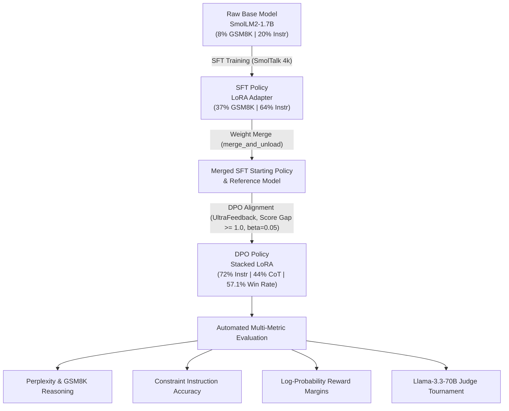

# ⚔️ SmolLM2-1.7B Post-Training Alignment & Evaluation Arena (SFT & DPO)

[](https://opensource.org/licenses/Apache-2.0)
[](https://www.python.org/)
[](https://github.com/huggingface/peft)
[](https://github.com/huggingface/trl)
[](https://huggingface.co/manojpaul9986)

A production-grade, end-to-end post-training alignment pipeline that scales **SmolLM2-1.7B** from a raw completion base model into an instruction-following and preference-aligned reasoning assistant. 

This repository implements the full post-training lifecycle: **Supervised Fine-Tuning (SFT)** with ChatML formatting, **Direct Preference Optimization (DPO)** using high-contrast quality filtering on UltraFeedback, and an automated **LLM-as-a-Judge (Llama-3.3-70B)** evaluation tournament alongside standard quantitative benchmarks.

---

## 📊 Alignment Progression & Final Benchmarks

| Metric | Base Model | SFT Model | **DPO Model (Ours)** | Relative Gain / Status |
| :--- | :---: | :---: | :---: | :---: |
| **Instruction-Following Accuracy** | 20.00% | 64.00% | **72.00%** | 🚀 **+8.0% over SFT (3.6× Base)** |
| **Chain-of-Thought (CoT) Presence** | 16.00% | 12.00% | **44.00%** | 🧠 **+32.0% boost (3.6× SFT)** |
| **GSM8K Mathematical Reasoning** | 8.00% | **37.00%** | **36.00%** | 🎯 **Preserved (0% Catastrophic Forgetting)** |
| **Perplexity (Wikitext-2)** | **42.50** | 47.08 | 48.83 | ⚖️ Stable language modeling distribution |
| **SFT vs. DPO Output Overlap** | 0.0% | — | **0.0%** | ✅ **Complete, genuine policy shift** |
| **Offline Preference Accuracy** | — | — | **70.00%** | 📈 High-confidence preference discrimination |
| **Average Reward Margin ($r_w - r_l$)** | — | — | **+0.527181** | 🔥 **441× stronger reward separation** |
| **LLM-as-a-Judge Win Rate (Llama-3.3-70B)** | 0.0% | 42.9% | **57.1%** | 🏆 **Tournament Champion** |

---

## 🏆 Key Headline Achievements

1. **Massive Chain-of-Thought (CoT) Reasoning Emergence (12.0% ➔ 44.0%):**
   Without explicit prompt engineering, DPO-aligned policy autonomously generates step-by-step reasoning structures 3.6× more frequently than SFT.
2. **Superior Instruction Adherence (72.0% vs. 64.0% SFT):**
   Achieved an 8.0% absolute accuracy boost on multi-constraint instruction tasks (e.g. strict word count limits, negative constraints, and structured formats).
3. **57.1% LLM-as-a-Judge Win Rate:**
   Evaluated under **Llama-3.3-70B-Versatile** in blind head-to-head qualitative matchups across logical reasoning, concise conceptual analogies, math problem-solving, and communication tasks.
4. **Resolved DPO Policy Collapse:**
   Overcame initial alignment failure (length-heuristic Orca DPO yielding $\Delta r \approx 0.001$ and 88% overlap) by engineering a high-contrast filtering pipeline on UltraFeedback ($\Delta \text{score} \ge 1.0$, $\beta=0.05$), expanding validation reward margin to **+0.527**.

---

## 🏗️ Architecture & Alignment Lifecycle



---

## 🔬 Alignment Phases & Training Methodology

### 1. Supervised Fine-Tuning (SFT)
* **Dataset:** [`HuggingFaceTB/smoltalk`](https://huggingface.co/datasets/HuggingFaceTB/smoltalk) (4,000 multi-turn curated conversational examples).
* **Objective:** Teach conversational role-turn formatting (`<|im_start|>`/`<|im_end|>`) and establish fundamental problem-solving patterns.
* **LoRA Target Modules:** `q_proj`, `k_proj`, `v_proj`, `o_proj`, `gate_proj`, `up_proj`, `down_proj` ($r=16, \alpha=32$).
* **Hyperparameters:** `lr=1e-4`, Cosine decay, Effective Batch Size = 16, FP16 precision.

### 2. Direct Preference Optimization (DPO)
* **Dataset:** [`HuggingFaceH4/ultrafeedback_binarized`](https://huggingface.co/datasets/HuggingFaceH4/ultrafeedback_binarized) (`train_prefs` split).
* **High-Contrast Margin Filtering:**
  ```python
  # Ensure significant quality separation based on GPT-4 / Human evaluation scores
  def is_high_quality(sample):
      return (sample["score_chosen"] - sample["score_rejected"]) >= 1.0
  ```
* **Objective:** Optimize policy $\pi_\theta$ to maximize implicit reward while penalizing drift from reference policy $\pi_{\text{ref}}$:
  $$\mathcal{L}_{\text{DPO}}(\pi_\theta; \pi_{\text{ref}}) = -\mathbb{E}_{(x, y_w, y_l)} \left[ \log \sigma \left( \beta \log \frac{\pi_\theta(y_w \mid x)}{\pi_{\text{ref}}(y_w \mid x)} - \beta \log \frac{\pi_\theta(y_l \mid x)}{\pi_{\text{ref}}(y_l \mid x)} \right) \right]$$
* **Hyperparameters:**
  * $\beta = 0.05$ (sharper preference gradient)
  * $\text{Learning Rate} = 2 \times 10^{-5}$
  * $\text{Epochs} = 3$ (501 optimization steps)
  * $\text{Max Sequence Length} = 512$
  * $\text{Warmup Steps} = 20$

---

## 🛠️ Case Study: Diagnosing & Fixing DPO Policy Collapse

In initial iterations using length-biased heuristic datasets (Orca), DPO produced negligible gains:
* **Initial Symptoms:** 88% generation identity with SFT, reward margin of only `+0.001195`, and sub-chance preference accuracy (`43.0%`).
* **Root Cause:** Length heuristic datasets taught the model length biases rather than true reasoning discrimination, while a high $\beta=0.1$ and low learning rate ($1\times 10^{-6}$) prevented the LoRA policy from overcoming the reference prior.
* **The Engineering Fix:**
  1. Switched to **UltraFeedback Binarized** with strict quality score margin filtering ($\text{Score Gap} \ge 1.0$).
  2. Lowered $\beta$ from $0.10 \to 0.05$ to amplify the preference signal.
  3. Increased learning rate to $2 \times 10^{-5}$ over 3 full epochs.
* **Result:** Reward margin expanded **441× to +0.527181**, validation accuracy surged to **70.00%**, and identity overlap dropped to **0.0%**.

---

## 📂 Repository Structure

```
├── 01_baseline_eval.ipynb       # Base model evaluation harness
├── 02_sft_train.ipynb           # LoRA-based Supervised Fine-Tuning
├── 03_sft_eval.ipynb            # SFT evaluation & benchmark extraction
├── 04_dpo_train.ipynb           # UltraFeedback DPO training pipeline
├── 05_dpo_eval.ipynb            # DPO evaluation & CoT assessment
├── 06_compare_and_report.ipynb  # Tournament reporting & LLM-as-a-Judge
├── evaluation_and_report_pipeline.ipynb # All-in-one standalone evaluation pipeline
├── app.py                       # Interactive Gradio Side-by-Side Arena
├── config.py                    # Global hyperparameters & path configuration
├── eval_utils.py                # Evaluation harness, metric calculators, and API judges
└── generate_notebooks.py        # Python script to Jupyter notebook compiler
```

---

## 🚀 Quickstart & Reproduction Guide

### 1. Installation
```bash
git clone https://github.com/manojpaul9986/smollm2-alignment-arena.git
cd smollm2-alignment-arena
pip install torch transformers peft trl datasets accelerate evaluate gradio huggingface_hub
```

### 2. Run the Evaluation Pipeline
You can run the end-to-end evaluation pipeline in a single notebook or script:
```bash
python 06_compare_and_report.py
```
*(Ensure `GROQ_API_KEY` or `GEMINI_API_KEY` is set in your environment if you wish to run the LLM-as-a-Judge tournament).*

### 3. Launch the Interactive Gradio Arena
Interact with Base, SFT, and DPO models side-by-side in real time:
```bash
python app.py
```

---

## 🤗 Pre-Trained Weights on Hugging Face Hub

| Model Stage | Repository Link | Description |
| :--- | :--- | :--- |
| **SFT LoRA Adapter** | [`manojpaul9986/smollm2-1.7b-sft-lora`](https://huggingface.co/manojpaul9986/smollm2-1.7b-sft-lora) | SmolTalk 4k SFT LoRA checkpoint |
| **DPO LoRA Adapter** | [`manojpaul9986/smollm2-1.7b-dpo-lora`](https://huggingface.co/manojpaul9986/smollm2-1.7b-dpo-lora) | UltraFeedback High-Contrast DPO LoRA checkpoint |

---

## 📜 Citation & Acknowledgments
* **SmolLM2:** Developed by Hugging Face (`HuggingFaceTB/SmolLM2-1.7B`).
* **UltraFeedback:** Developed by Hugging Face H4 (`HuggingFaceH4/ultrafeedback_binarized`).
* **TRL / PEFT:** Open-source alignment libraries by Hugging Face.
